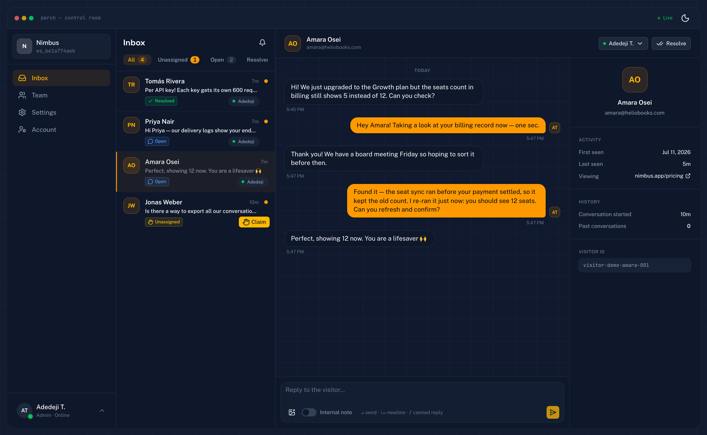
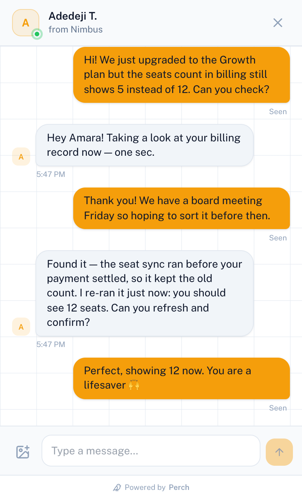

# Perch 🐦

**A fast, easy Intercom alternative — real-time, multi-tenant, and embeddable.**

Perch is a hosted customer-support platform in the vein of Intercom, Crisp, and Tawk.to. A business
creates a workspace and adds one `<script>` tag to its site. Visitors chat from a floating widget;
support teams reply from a real-time **Control Room** with a shared inbox, team collaboration,
automations, a help center, proactive messages, and simple workspace pricing.

> Built from scratch and run as a real product: real-time systems, presence, multi-tenancy with
> auth scoping, secure third-party embedding, and concurrency correctness.

**Live:** https://useperch.xyz &nbsp;·&nbsp; **Stack:** Nuxt 4 · Nitro WebSockets · Drizzle · Neon Postgres


**The Control Room** — shared inbox with claim-race-safe assignment, internal notes, and a live
visitor context panel:



**The widget** your visitors see — presence, read receipts, and optional image attachments when
Cloudinary is configured:

<p align="center">
  
</p>

---

## What it does

**For the business (the Control Room)**
- Email/password or Google auth with sealed-cookie sessions; a user can belong to multiple workspaces.
- Real-time shared inbox with priority, snoozing, search, bulk actions, tags, advanced filters, and personal saved views.
- **Claim / assign / reassign** conversations, with an atomic first-claim-wins race guard and role-aware visibility.
- Per-agent unread tracking, internal notes, teammate mentions and notifications, resolve/reopen, canned replies, and image attachments.
- **Nest** team chat with presence, `@mentions`, notification delivery, and consistent message threads.
- Live team presence (online / away / offline) and role-scoped visibility (agents see unassigned + their own; admins see everything).
- Help-center articles and groups, with public search inside the hosted help center and widget.
- Visitor and support analytics, response targets, personal notification preferences, browser notifications, and optional unanswered-message email reminders.
- Template-driven automations for round-robin and page routing, verified VIP tagging, inactivity reminders, and safe automatic closing.
- Proactive widget triggers based on page, visit count, time on page, and audience rules.
- Team management, audit history, outbound conversation webhooks, operator metrics, and recoverable background-job failures.
- Free and Pro workspace entitlements with Bachs checkout, signed webhooks, canonical provider verification, and durable reconciliation.

**For the visitor (the widget)**
- One `<script>` tag, no build step, isolated in an iframe so it can't collide with the host site.
- Anonymous identity via a `localStorage` `visitor_id` — closing/refreshing resumes the same conversation.
- Live thread, agent typing indicator, and a "business online/offline" status.
- Optional pre-chat form (name / email), toggleable per workspace.
- Help-center search without leaving the widget, optional image attachments, and explicit opt-in for email replies.
- **`Perch.identify()`** — sites with signed-in users pass `{ user_id, name, email }` so pre-chat is
  skipped and agents see who they're talking to, with optional **HMAC identity verification** so
  visitors can't impersonate each other (see below).

### Identify your users

```html
<script>
  // if your user is signed in when the page renders (safe in any script order —
  // the loader picks this up when it initializes):
  window.perchIdentity = {
    user_id: 'user_42',
    name: 'Ada Lovelace',
    email: 'ada@example.com',
    hash: '<hmac of user id from your server>', // required if verification is enforced
    email_hash: '<hmac of normalized email from your server>'
  }

  // or, for logins that happen after page load (SPA):
  Perch.identify({ user_id, name, email, hash, email_hash })
</script>
```

With **identity verification** enabled (Settings → Identity verification), Perch rejects any
identify call whose `hash` isn't a valid HMAC-SHA256 of the `user_id` (or email), keyed with the
workspace's secret — computed on the business's server, never in the browser:

```js
// Node.js — on YOUR server
import { createHmac } from 'node:crypto'
const hash = createHmac('sha256', PERCH_IDENTITY_SECRET).update(user.id).digest('hex')
const email_hash = createHmac('sha256', PERCH_IDENTITY_SECRET).update(user.email.toLowerCase()).digest('hex')
```

`hash` proves the user ID. When an email accompanies a user ID, `email_hash` separately proves the
email address. A signed address is still not a subscription: when visitor reply email is enabled,
the visitor explicitly chooses reply emails in the widget.

Verified visitors get a green **Verified** badge in the agent's context panel.

---

## Plans

Perch prices the workspace, not each teammate:

| Plan | Price | Includes |
|---|---:|---|
| Free | $0 | Unlimited conversations, 2 teammates, shared inbox, Nest, help center, core automations, and 15-minute unanswered-message reminders |
| Pro | $9/month or $90/year | Everything in Free, unlimited teammates, configurable reminder timing, business-hours delivery, and removable Perch branding |

Sandbox checkout is verified on staging. Live Bachs checkout remains fail-closed until the provider's
recurring subscription response contract is verified authoritatively; existing webhook and
reconciliation processing remains independent of the new-checkout switch.

---

## What this project demonstrates

- **Real-time architecture with a typed event contract.** The client→server and server→client event
  shapes live in a shared package (`@perch/shared`) imported by the dashboard, the widget, and the
  server — so the WebSocket boundary is type-safe end to end.
- **Concurrency correctness.** Two agents claiming the same conversation can never both win: the claim
  is an atomic conditional write (`UPDATE ... WHERE status = 'unassigned'`), and rows-affected decides
  winner vs. conflict — not an application-level check.
- **Secure third-party embedding.** The widget runs on arbitrary sites in a sandboxed iframe, authed
  with short-lived HMAC-signed tickets scoped to one `workspace + visitor`. A visitor connection can
  only ever subscribe to its own conversation — never `workspace:*` or another visitor's thread.
  Host-site identities are verifiable with Intercom-style HMAC signatures (timing-safe comparison,
  per-workspace secret, optional enforcement).
- **Multi-tenancy with auth scoping.** Every query is scoped by workspace membership and role;
  internal notes are filtered **server-side** before they ever reach a visitor socket.
- **Production hardening.** Rate limiting on every public and auth endpoint (per-IP and per-account
  brute-force throttles, per-visitor message caps), a full password-reset flow with single-use
  hashed tokens, transactional email (Resend) for resets, unanswered reminders, visitor replies, and team invites, a per-workspace
  **domain allowlist** (a copied site_id can't be embedded on a stranger's site), Sentry error
  tracking, attachment cleanup recovery, signed provider webhooks, billing reconciliation, and a
  real `/api/health` check.
- **Tested where it hurts.** A Vitest suite covers the security-critical invariants: ticket
  signing/tampering/expiry, identity HMAC verification, authorization, domain look-alike attacks,
  rate limits, notification races, webhook retries, payment verification, reconciliation, and agent
  visibility scoping — `pnpm test`.
- **A deliberate, documented scaling path** (`publish()` → Redis pub/sub) that is intentionally *not*
  built for v1 — see [Scaling](#scaling-the-real-time-layer).

---

## Architecture

### The two-frontend rule
Nuxt powers the **dashboard**, not the widget loader. There are three distinct pieces:

1. **Dashboard** — the full Nuxt 4 app (Control Room, auth, settings). Nitro also serves the REST API
   and the WebSocket handler.
2. **`widget.js` loader** — a tiny vanilla-TypeScript bundle (built with `tsup`) that reads
   `data-site-id` off its own `<script>` tag and injects an isolated iframe. It ships **no framework
   runtime**, so it's safe to drop on any third-party site.
3. **Widget frame** — the chat UI rendered *inside* the iframe (a Nuxt route), sandboxed from the host page.

### One process, single instance
The REST API, the WebSocket handler, the in-process pub/sub bus, and the presence registry all run in
**one Nitro process**. That's a deliberate v1 choice: in-memory fan-out needs no Redis, but it does
mean the real-time layer is single-instance. The scaling path is documented below and isolated to one file.

### Real-time event contract (the spine)
Two channels carry everything:

| Channel | Subscribers | Purpose |
|---|---|---|
| `workspace:{id}` | online agents in the workspace | inbox events: new conversation, assignment, presence |
| `conversation:{id}` | agents viewing it + the visitor | message stream, typing, read receipts |

All mutations happen over REST and fan out via `publish()` / `publishFiltered()`; the WS handler owns
only the connection lifecycle, authorized subscription, presence, and typing relay. Agent visibility is
enforced with a `publishFiltered(channel, event, predicate)` that checks each peer's role/member id
against the conversation's assignee.

### Scaling the real-time layer

The current production shape intentionally runs one application instance. Before adding replicas,
replace the in-memory publish/subscribe bus and presence registry with shared infrastructure such as
Redis pub/sub plus expiring presence records. The REST mutations, typed event contract, channel
authorization, and filtered delivery rules can remain unchanged.

### Tech stack

| Concern | Choice |
|---|---|
| Framework | Nuxt 4 + Nitro (one app = frontend + API + WS) |
| Real-time | Nitro WebSockets (`defineWebSocketHandler`, crossws) |
| UI | Tailwind + Nuxt UI |
| Language | TypeScript everywhere (shared types across all boundaries) |
| Database | Postgres on Neon (serverless) |
| ORM | Drizzle (schema + migrations) |
| Dashboard auth | nuxt-auth-utils (sealed cookie sessions) |
| Visitor auth | short-lived HMAC-signed WS tickets scoped to `site_id` + `visitor_id` |
| Hosting | A long-lived container host such as Railway (single Nitro process) |

---

## Monorepo layout

```
perch/
├── app/                    # Nuxt dashboard + widget frame (pages, composables, components)
├── server/
│   ├── api/                # REST endpoints (auth, workspaces, conversations, widget)
│   ├── routes/api/ws.ts    # the WebSocket handler
│   └── utils/              # db, realtime (publish/subscribe), presence, ws-ticket
├── packages/
│   ├── shared/             # the §6 event contract: events, models, enums (type-safe everywhere)
│   ├── db/                 # Drizzle schema + migrations
│   └── widget-loader/      # vanilla TS → builds widget.js (the embeddable file)
├── Dockerfile              # multi-stage build → self-contained Nitro .output
└── PRD.md                  # the product spec this was built against
```

---

## Local development

**Prerequisites:** Node 22+, [pnpm](https://pnpm.io) 11+, and a Neon (or any Postgres) database.

```bash
# 1. install
pnpm install

# 2. copy the environment template and fill in the required values
cp .env.example .env

# 3. run migrations against your database
pnpm --filter @perch/db db:migrate

# 4. build the embeddable widget once
pnpm --filter @perch/widget-loader build

# 5. start the dev server (http://localhost:2222)
pnpm dev
```

Useful scripts: `pnpm build` (production Nitro bundle), `pnpm preview`, `pnpm lint`, `pnpm typecheck`,
and `pnpm test`. Database-backed integration tests run when `TEST_DATABASE_URL` points to an isolated
test database; never point destructive integration tests at staging or production.

### Environment variables

| Variable | Purpose |
|---|---|
| `NEON_CONNECTION_STRING` | Postgres connection string (Neon or any Postgres) |
| `NUXT_SESSION_PASSWORD` | 32+ char secret — seals auth cookies **and** signs the HMAC WS tickets |
| `NUXT_OAUTH_GOOGLE_CLIENT_ID` / `NUXT_OAUTH_GOOGLE_CLIENT_SECRET` | *(optional)* Google OAuth web-client credentials; both are required to enable Google sign-in |
| `NUXT_OAUTH_GOOGLE_REDIRECT_URL` | *(required with Google OAuth)* Exact callback URL registered in Google Cloud, e.g. `https://useperch.xyz/auth/google` |
| `REALTIME_SECRET` | *(optional)* separate 32+ char HMAC secret for realtime and visitor tickets; otherwise `NUXT_SESSION_PASSWORD` is reused |
| `RESEND_API_KEY` | Transactional email for password resets and invites. Optional only during local development; every production-mode deployment, including Railway staging, requires its own key |
| `RESEND_FROM` | Verified sender, e.g. `Perch <no-reply@yourdomain.com>`. Optional only during local development and required with `RESEND_API_KEY` in deployed environments |
| `VISITOR_REPLY_SECRET` | Separate 32+ character secret for one-time visitor return and unsubscribe links |
| `VISITOR_EMAIL_HASH_SECRET` | Stable, separate 32+ character HMAC key for email suppression and delivery-dedup hashes. Do not rotate it during normal return-link key rotation |
| `VISITOR_REPLY_EMAIL_FEATURE_ENABLED` | Global feature-exposure gate. When `false`, Settings and the widget do not offer visitor reply emails and the opt-in API rejects requests |
| `VISITOR_REPLY_EMAIL_DELIVERY_ENABLED` | Independent delivery safety gate. It requires feature exposure and must remain `false` until the approved scheduled worker and Resend bounce/complaint webhook are configured |
| `RESEND_WEBHOOK_SECRET` | Signed Resend webhook secret used to verify bounce/complaint events and durably suppress unsafe future delivery; visitor reply delivery must stay disabled until this is configured |
| `BACHS_ENV` / `BACHS_SECRET_KEY` / `BACHS_WEBHOOK_SECRET` | Bachs subscription environment, API key, and webhook signature secret. Configure all three together |
| `PERCH_BILLING_CHECKOUT_ENABLED` | Fail-closed gate for new paid checkouts. Explicit sandbox checkout is allowed for contract verification, but live checkout remains closed until Bachs' canonical recurring product/subscription response contract is authoritatively verified. Disabling it does not interrupt existing subscriptions or webhooks |
| `SENTRY_DSN` / `NUXT_PUBLIC_SENTRY_DSN` | *(optional)* server and browser error tracking. The public value is exposed to the browser by design and must never contain a secret |
| `SENTRY_ENVIRONMENT` / `NUXT_PUBLIC_SENTRY_ENVIRONMENT` | Labels server and browser events by environment, such as `staging` or `production` |
| `CLOUDINARY_CLOUD_NAME` / `CLOUDINARY_API_KEY` / `CLOUDINARY_API_SECRET` | *(optional)* signed image attachments. Configure all three to expose uploads; existing attachment rendering remains available without upload credentials |
| `PERCH_PUBLIC_URL` | Canonical origin used in prerendered SEO metadata and account links. Use `http://localhost:2222` locally, the staging HTTPS origin on staging, and `https://useperch.xyz` in production; it must be present during build and runtime |
| `PERCH_ADMIN_EMAILS` | *(optional)* comma-separated operator emails allowed to access instance metrics |
| `NUXT_PUBLIC_DEMO_SITE_ID` | *(optional)* workspace site ID used by the landing-page demo widget |
| `PERCH_WEBHOOK_DELIVERY_ENABLED` | Safety gate for durable outbound conversation webhook processing and admin replay. Keep `false` until customer-data egress and destinations are approved |
| `PERCH_WEBHOOK_ALLOW_LOCALHOST` | Local-only escape hatch for testing webhook receivers over HTTP. Production startup rejects it when enabled |

> Nuxt only auto-maps `NUXT_`-prefixed env at runtime. The server reads the documented plain
> environment variable names directly as production fallbacks.

The visitor reply and email-hash secrets are required only when visitor reply email exposure or
delivery is enabled. Keep the stable hash secret available for as long as suppression or delivery
records exist: replacing it makes existing email hashes impossible to match.

For Google sign-in, create an OAuth 2.0 **Web application** client in Google Cloud and register the
exact local and deployed callback URLs (`http://localhost:2222/auth/google` and
`https://useperch.xyz/auth/google`). Keep the client secret server-side.

Provider webhook endpoints:

| Provider | Staging | Production |
|---|---|---|
| Bachs | `https://staging.useperch.xyz/api/webhooks/bachs` | `https://useperch.xyz/api/webhooks/bachs` |
| Resend | `https://staging.useperch.xyz/api/webhooks/resend` | `https://useperch.xyz/api/webhooks/resend` |

Bachs signs billing events and Resend signs bounce/complaint events. Perch verifies each signature
before accepting the event; do not place webhook secrets in URLs or browser code.

---

## Deployment

The whole app is one Nitro process, so it deploys as a single service on a host configured for
**long-lived WebSocket connections**. The current deployment uses Railway. The included multi-stage `Dockerfile` produces a
self-contained `.output`, and its CMD runs **pending database migrations before booting the
server** (`scripts/migrate.mjs`, bundled at build time) — a deploy with unapplied migrations
fails loudly instead of serving against a stale schema.

**Backups:** Neon's point-in-time restore covers recent mistakes; `scripts/backup.sh` creates an
atomic, checksummed PostgreSQL archive for private off-provider storage. Schedule it on an
always-on service, then use `scripts/restore-verify.sh` for the required fresh-database restore
drill before launch and at least monthly. See `docs/LAUNCH_OPERATIONS.md` for the checklist.

Notes from getting this live on a small tier:
- The Nitro build can OOM on small builders — the Dockerfile raises V8's heap
  (`--max-old-space-size=4096`) and server/client sourcemaps are disabled in `nuxt.config.ts`.
- `/api/health` is the real readiness check (signing configuration + database). Point uptime monitoring there —
  pinging `/` proves nothing, since the landing page is prerendered.
- Free-tier services that sleep on idle break presence; an UptimeRobot monitor on `/api/health`
  every 5 minutes keeps both the instance and Neon's compute warm.
- Errors report to Sentry (`@sentry/nuxt`); source-map upload is deliberately off to keep builds
  inside the free-tier builder's RAM.

---


## Status and launch boundary

Perch is in private pre-launch development. The main customer-support journey is built: authentication,
workspaces, installation, shared inbox, assignment and reassignment, internal notes and mentions,
Nest team chat, help center, automations, proactive triggers, analytics, visitor context, attachments,
notifications, reminder emails, workspace billing, audit history, and account/workspace lifecycle controls.

The repository also includes production-oriented safeguards: server-side tenant authorization,
revocable sessions, email verification and recovery, rate limits, domain allowlists, signed visitor
identity, signed provider webhooks, fail-closed feature gates, idempotent billing, durable background
jobs, operator recovery screens, migrations-on-deploy, health checks, backups, and restore verification.

Before public launch, complete the operational checklist in
[`docs/LAUNCH_OPERATIONS.md`](docs/LAUNCH_OPERATIONS.md), verify the live Bachs recurring contract and
payment lifecycle, run a restore drill, review customer-data egress, and complete production-like
cross-role and mobile acceptance testing.


---

## License

See [LICENSE](LICENSE).
